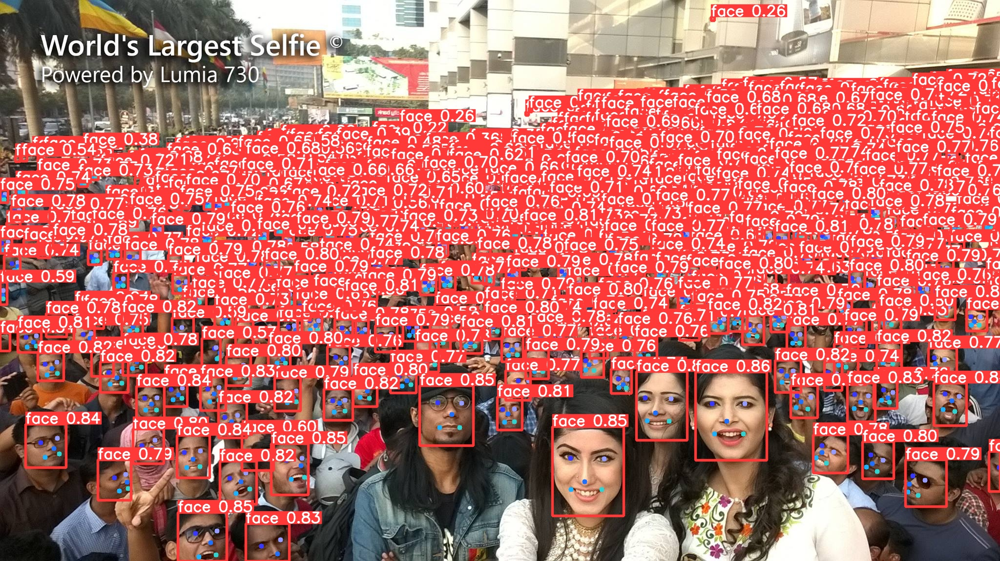

# yolov8-face

| Method          |  Test Size | Easy  | Medium | Hard  | FLOPs (B) @640 | weights  |
| ----------------| ---------- | ----- | ------ | ----- | -------------- | -------- |
| yolov8-lite-t   | 640        | -     | -      | -     |  -             | -       |
| yolov8-lite-s   | 640        | -     | -      | -     |  -             | -       |
| yolov8n         | 640        | 94.5  | 92.2   | 79.0  |  -             |  [google](https://drive.google.com/file/d/1qcr9DbgsX3ryrz2uU8w4Xm3cOrRywXqb/view?usp=sharing)       |
| yolov8s         | 640        | 96.0  | 94.2   | 82.6  |  -             | -       | 
| yolov8m         | 640        | 96.6  | 95.0   | 84.1  |  -             | -       |

#### yolov8n-face

#### References

* [https://github.com/ultralytics/ultralytics](https://github.com/ultralytics/ultralytics)

* [https://github.com/deepcam-cn/yolov5-face](https://github.com/deepcam-cn/yolov5-face)

* [https://github.com/derronqi/yolov7-face](https://github.com/derronqi/yolov7-face)
